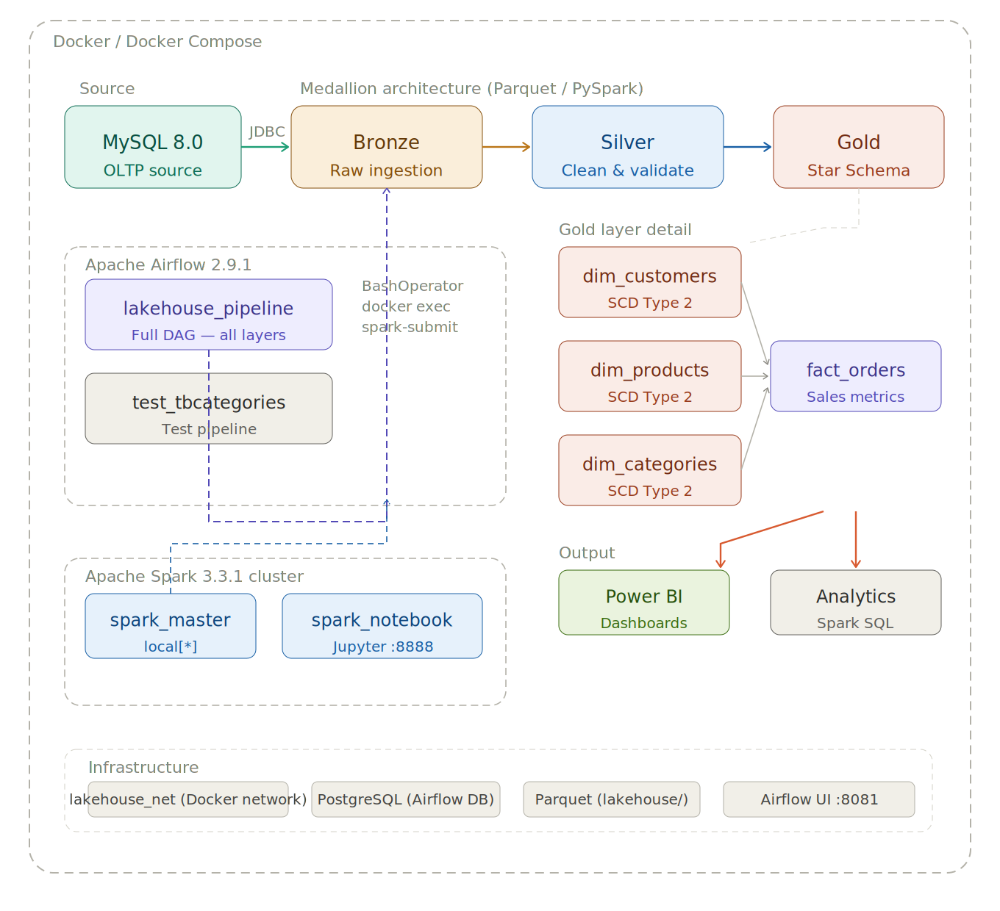

# MySpark - Data Warehouse with Medallion Architecture 🏗️

## 📌 About the Project

This is my personal **Data Engineering** portfolio project, developed to demonstrate practical skills in building ETL pipelines, dimensional modeling, and implementing modern Data Warehouses.

After several courses and studies on Spark and Medallion architecture, I decided to build my own project from scratch, applying advanced concepts and adding my own implementation vision. A key differentiator of this project is the implementation of **SCD Type 2 (Slowly Changing Dimensions)** in Spark, a technique rarely seen in educational projects but essential in corporate environments for maintaining dimensional change history.

## 👨‍💻 Author

**Rodrigo Ribeiro**  
Data Engineer  
[](https://www.linkedin.com/in/rodrigo-ribeiro-pro/)

---

## 🎯 Project Goals

- Implement complete **Medallion** architecture (Bronze → Silver → Gold)
- Build **Data Warehouse** with dimensional model (Star Schema)
- Apply **SCD Type 2** for historical change tracking
- Process data with **Apache Spark** using PySpark
- Orchestrate complete environment with **Docker**
- Validate data quality across layers
- Query the lakehouse via SQL IDE using **Apache Kyuubi**
- Demonstrate Data Engineering best practices

---

## 🏛️ Project Architecture

### Technologies Used

- **Apache Spark 3.5** - Distributed data processing
- **PySpark** - Python API for Spark
- **MySQL 8.0** - Source database (OLTP)
- **Docker & Docker Compose** - Containerization and orchestration
- **Jupyter Notebook** - Exploratory analysis
- **Apache Airflow 2.9.1** - Pipeline orchestration
- **Apache Kyuubi 1.10.3** - SQL gateway for JDBC/ODBC access to Spark
- **DBeaver** - SQL IDE connected to the lakehouse via Kyuubi
- **Parquet** - Columnar storage format



### Medallion Architecture
```
┌─────────────┐      ┌─────────────┐      ┌─────────────┐      ┌─────────────┐
│   MySQL     │ ───> │   Bronze    │ ───> │   Silver    │ ───> │    Gold     │
│   (OLTP)    │      │  Raw Data   │      │  Cleaned    │      │  Business   │
└─────────────┘      └─────────────┘      └─────────────┘      └─────────────┘
   Source            Ingestion           Validation         DW Modeling
                                                                    │
                                                                    ▼
                                                           ┌─────────────────┐
                                                           │  Apache Kyuubi  │
                                                           │  (SQL Gateway)  │
                                                           └────────┬────────┘
                                                                    │ JDBC
                                                                    ▼
                                                           ┌─────────────────┐
                                                           │     DBeaver     │
                                                           │   (SQL IDE)     │
                                                           └─────────────────┘
```

#### 🥉 **Bronze Layer (Raw Data)**
- **Purpose:** Ingest raw data from MySQL without transformations
- **Format:** Parquet
- **Characteristics:**
  - Faithful copy of source data
  - Preservation of original data types
  - Foundation for future reprocessing
- **Tables:** `tbcategories`, `tbproducts`, `tbcustomers`, `tborders`, `tborderdetail`

#### 🥈 **Silver Layer (Cleaned & Validated)**
- **Purpose:** Cleansing, validation, and standardization of data
- **Format:** Parquet
- **Characteristics:**
  - Duplicate removal
  - Null value handling
  - Format standardization
  - Integrity validations
- **Tables:** Same as Bronze, but refined

#### 🥇 **Gold Layer (Business Ready)**
- **Purpose:** Dimensional modeling for analytics and BI
- **Format:** Parquet
- **Characteristics:**
  - Star Schema model
  - Dimensions with SCD Type 2
  - Aggregated fact table
  - Optimized for analytical queries

---

## 📊 Dimensional Modeling (Star Schema)

### Dimensions (SCD Type 2)

#### **dim_categories**
Product categories dimension with change history.

**Columns:**
- `category_sk` - Surrogate Key
- `category_code` - Business Key (original code)
- `category_description` - Category description
- `valid_from` - Start date of validity
- `valid_to` - End date of validity (NULL = current)
- `is_current` - Flag indicating current version

#### **dim_products**
Products dimension with tracking of changes in price, description, status, and category.

**Columns:**
- `product_sk` - Surrogate Key
- `product_code` - Business Key
- `product_description` - Product description
- `sale_value` - Sale price
- `is_active` - Active/inactive status
- `category_code` - FK to category
- `valid_from`, `valid_to`, `is_current` - SCD2 control

**Tracked changes:**
- Price changes
- Description updates
- Category modifications
- Product activation/deactivation

#### **dim_customers**
Customers dimension with history of registration changes.

**Columns:**
- `customer_sk` - Surrogate Key
- `customer_code` - Business Key
- `customer_name` - Customer name
- `customer_address` - Address
- `customer_phone` - Phone number
- `customer_email` - Email
- `birth_date` - Birth date
- `valid_from`, `valid_to`, `is_current` - SCD2 control

**Tracked changes:**
- Address updates
- Phone/email changes
- Registration updates

### Fact Table

#### **fact_orders**
Consolidated sales fact table with aggregated metrics.

**Columns:**
- `order_code` - Order code (Degenerate Dimension)
- `customer_code` - FK to dim_customers
- `product_code` - FK to dim_products
- `order_date` - Order date/time
- `total_quantity` - Total quantity sold
- `total_sales` - Total value (quantity × unit_price)
- `line_count` - Number of detail lines

**Granularity:** One row per product per order

**Calculated metrics:**
- Total revenue per product/order
- Total quantity sold
- Transaction count

---

## 🔄 SCD Type 2 (Slowly Changing Dimensions)

### Concept

SCD Type 2 maintains **complete change history** in dimensions, enabling accurate temporal analysis.

**Practical example:**

A product had its price changed:

| product_sk | product_code | description | sale_value | valid_from | valid_to | is_current |
|------------|--------------|-------------|------------|------------|----------|------------|
| 1 | 100 | Gaming Mouse | 150.00 | 2024-01-01 | 2024-06-15 | false |
| 42 | 100 | RGB Gaming Mouse | 180.00 | 2024-06-16 | NULL | true |

**Benefits:**
- ✅ Historical price analysis
- ✅ Registration change tracking
- ✅ Complete audit trail
- ✅ Point-in-time reporting

### Implementation

**SCD2 Algorithm:**
1. Detect new records and changes
2. Expire old versions (set `is_current = false`, `valid_to = current_date`)
3. Generate new surrogate key for updated versions
4. Insert new versions with `is_current = true`

---

## 🔌 Apache Kyuubi — SQL Gateway

[Apache Kyuubi](https://kyuubi.apache.org/) is a distributed SQL gateway that exposes Spark via a **HiveServer2-compatible JDBC/ODBC interface**, enabling any SQL IDE (such as DBeaver) to query the lakehouse directly without replacing the Spark engine.

### How it fits in the stack

```
DBeaver (SQL IDE)
      │  JDBC (port 10009)
      ▼
Apache Kyuubi
      │  spark-submit
      ▼
Apache Spark ──► Parquet files (Bronze / Silver / Gold)
```

Kyuubi acts as a gateway — it receives SQL queries from DBeaver, submits them to Spark, and returns the results. Unlike Trino, it does **not** replace Spark as the execution engine.

### Configuration (`kyuubi-defaults.conf`)

```properties
kyuubi.engine.spark.master=spark://spark-master:7077
kyuubi.engine.share.level=SERVER
kyuubi.engine.type=SPARK_SQL
spark.home=/opt/kyuubi/externals/spark-3.5.2-bin-hadoop3
```

### DBeaver Connection

| Field | Value |
|---|---|
| Driver | Apache Hive 2 |
| Host | `localhost` |
| Port | `10009` |
| Database | `default` |
| URL | `jdbc:hive2://localhost:10009/default;connectTimeout=60000;socketTimeout=120000` |
| Username / Password | *(leave blank)* |

> **Note:** On first connection, Kyuubi needs ~15–20 seconds to launch the Spark engine. Increase DBeaver's connection timeout to at least 60 seconds to avoid premature disconnection.

### Registering tables in DBeaver

Since the Gold layer uses plain Parquet files (no Hive Metastore), tables must be registered per session before querying:

```sql
CREATE DATABASE IF NOT EXISTS bronze;
CREATE DATABASE IF NOT EXISTS silver;
CREATE DATABASE IF NOT EXISTS gold;

CREATE TABLE IF NOT EXISTS gold.dim_categories  USING parquet LOCATION '/data/gold/dim_categories';
CREATE TABLE IF NOT EXISTS gold.dim_products     USING parquet LOCATION '/data/gold/dim_products';
CREATE TABLE IF NOT EXISTS gold.dim_customers    USING parquet LOCATION '/data/gold/dim_customers';
CREATE TABLE IF NOT EXISTS gold.fact_orders      USING parquet LOCATION '/data/gold/fact_orders';
```

> **Note:** These registrations live in memory. If the Kyuubi container restarts, re-run the `CREATE TABLE` statements. A persistent Hive Metastore would eliminate this step and is listed as a future improvement.

### Example analytical query

```sql
SELECT
    c.customer_name,
    p.product_description,
    DATE_FORMAT(f.order_date, 'dd-MM-yyyy') AS date,
    SUM(f.total_quantity) AS quantity,
    ROUND(SUM(f.total_sales), 2) AS sales
FROM gold.fact_orders f
INNER JOIN gold.dim_customers c
    ON f.customer_code = c.customer_code
    AND c.is_current = true
INNER JOIN gold.dim_products p
    ON f.product_code = p.product_code
    AND p.is_current = true
GROUP BY c.customer_name, p.product_description, DATE_FORMAT(f.order_date, 'dd-MM-yyyy')
ORDER BY date DESC, sales DESC
```

---

## 📁 Project Structure
```
myspark/
├── spark/
│   ├── docker-compose.yml
│   ├── kyuubi-defaults.conf         # Kyuubi configuration
│   ├── Dockerfile
│   ├── jobs/
│   │   ├── test_mysql.py
│   │   ├── bronze_*.py              # Bronze ingestion
│   │   ├── silver_*.py              # Silver transformation
│   │   ├── gold_dim_*_scd2.py       # Gold dimensions with SCD2
│   │   ├── gold_fact_orders.py      # Fact table
│   │   ├── read_gold_*.py           # Read scripts
│   │   └── generic_query.py         # Generic query
│   ├── lakehouse/
│   │   ├── bronze/                  # Raw data
│   │   ├── silver/                  # Clean data
│   │   └── gold/                    # Dimensional model
│   └── work/                        # Jupyter notebooks
├── airflow/
│   ├── dags/
│   │   ├── dag_lakehouse_pipeline.py  # Full pipeline DAG
│   │   └── dag_test_tbcategories.py   # Test DAG (categories only)
│   ├── logs/
│   └── plugins/
└── mysql/
    ├── docker-compose.yml
    └── init/
        └── init.sql                 # Initialization script
```

---

## 🚀 Execution Guide

### Prerequisites

- Docker installed
- Docker Compose installed
- 8GB RAM available (recommended)
- DBeaver installed (for SQL IDE access via Kyuubi)

### Initial Setup

#### 1. Create Docker network (mandatory)
```bash
docker network create lakehouse_net
```

#### 2. Create directory structure
Inside the `spark/` folder, create:
```bash
mkdir -p lakehouse/bronze lakehouse/silver lakehouse/gold
```

Inside the `airflow/` folder, create:
```bash
mkdir -p airflow/dags airflow/logs airflow/plugins
```

#### 3. Start MySQL and Spark containers
```bash
cd mysql/
docker compose up -d

cd ../spark/
docker compose up -d
```

#### 4. Get Jupyter Notebook token
```bash
docker logs spark_notebook
```

Look for:
```
[I ########] http://127.0.0.1:8888/lab?token=99999...
```

Access: `http://localhost:8888` and use the token.

---

### Services Overview

| Service | URL | Credentials |
|---|---|---|
| Spark Master UI | http://localhost:8080 | — |
| Jupyter Notebook | http://localhost:8888 | token from logs |
| Airflow UI | http://localhost:8081 | admin / admin |
| Kyuubi JDBC | localhost:10009 | — |

---

### Execution Pipeline

#### **MySQL Connection Test**
```bash
docker exec -it spark_master spark-submit \
  --master local[*] \
  --packages com.mysql:mysql-connector-j:8.0.33 \
  /opt/spark/jobs/test_mysql.py
```

---

#### **Bronze Layer - Ingestion**
```bash
docker exec -it spark_master spark-submit --master local[*] --packages com.mysql:mysql-connector-j:8.0.33 /opt/spark/jobs/bronze_tbcategories.py
docker exec -it spark_master spark-submit --master local[*] --packages com.mysql:mysql-connector-j:8.0.33 /opt/spark/jobs/bronze_tbproducts.py
docker exec -it spark_master spark-submit --master local[*] --packages com.mysql:mysql-connector-j:8.0.33 /opt/spark/jobs/bronze_tbcustomers.py
docker exec -it spark_master spark-submit --master local[*] --packages com.mysql:mysql-connector-j:8.0.33 /opt/spark/jobs/bronze_tborders.py
docker exec -it spark_master spark-submit --master local[*] --packages com.mysql:mysql-connector-j:8.0.33 /opt/spark/jobs/bronze_tborderdetail.py
```

---

#### **Silver Layer - Cleansing and Validation**
```bash
docker exec -it spark_master spark-submit --master local[*] /opt/spark/jobs/silver_tbcategories.py
docker exec -it spark_master spark-submit --master local[*] /opt/spark/jobs/silver_tbproducts.py
docker exec -it spark_master spark-submit --master local[*] /opt/spark/jobs/silver_tbcustomers.py
docker exec -it spark_master spark-submit --master local[*] /opt/spark/jobs/silver_tborders.py
docker exec -it spark_master spark-submit --master local[*] /opt/spark/jobs/silver_tborderdetail.py
```

---

#### **Gold Layer - Dimensional Modeling**

**Dimensions with SCD Type 2:**
```bash
docker exec -it spark_master spark-submit --master local[*] /opt/spark/jobs/gold_dim_categories_scd2.py
docker exec -it spark_master spark-submit --master local[*] /opt/spark/jobs/gold_dim_products_scd2.py
docker exec -it spark_master spark-submit --master local[*] /opt/spark/jobs/gold_dim_customers_scd2.py
```

**Fact Table:**
```bash
docker exec -it spark_master spark-submit --master local[*] /opt/spark/jobs/gold_fact_orders.py
```

---

### 📖 Read and Analysis Scripts
```bash
docker exec -it spark_master spark-submit --master local[*] /opt/spark/jobs/read_gold_dim_categories.py
docker exec -it spark_master spark-submit --master local[*] /opt/spark/jobs/read_gold_dim_products.py
docker exec -it spark_master spark-submit --master local[*] /opt/spark/jobs/read_gold_dim_customers.py
docker exec -it spark_master spark-submit --master local[*] /opt/spark/jobs/read_gold_fact_orders.py
docker exec -it spark_master spark-submit --master local[*] /opt/spark/jobs/generic_query.py
```

---

## 🔍 Data Validation

### Spark vs MySQL Comparison

Execute equivalent SQL queries in MySQL to validate totals:
```sql
SELECT 
    o.customer AS customer_code,
    COUNT(DISTINCT o.code) AS total_orders,
    SUM(od.quantity) AS total_items,
    ROUND(SUM(od.quantity * od.salesvalue), 2) AS total_revenue
FROM tborders o
INNER JOIN tborderdetail od ON o.code = od.orders
WHERE o.customer IS NOT NULL
GROUP BY o.customer
ORDER BY total_revenue DESC
LIMIT 10;
```

**Validation checklist:**
- ✅ Revenue totals must be identical
- ✅ Order counts must match
- ✅ Top customers/products must be the same
- ✅ Record numbers must align

---

## 📊 Analysis Examples

### Query 1: Sales by Customer, Product and Date
```sql
SELECT
    c.customer_name,
    p.product_description,
    DATE_FORMAT(f.order_date, 'dd-MM-yyyy') AS date,
    SUM(f.total_quantity) AS quantity,
    ROUND(SUM(f.total_sales), 2) AS sales
FROM gold.fact_orders f
INNER JOIN gold.dim_customers c
    ON f.customer_code = c.customer_code
    AND c.is_current = true
INNER JOIN gold.dim_products p
    ON f.product_code = p.product_code
    AND p.is_current = true
GROUP BY c.customer_name, p.product_description, DATE_FORMAT(f.order_date, 'dd-MM-yyyy')
ORDER BY date DESC, sales DESC
```

### Query 2: Analysis by Category
```sql
SELECT
    cat.category_description,
    COUNT(DISTINCT f.order_code) AS total_orders,
    ROUND(SUM(f.total_sales), 2) AS revenue
FROM gold.fact_orders f
INNER JOIN gold.dim_products p
    ON f.product_code = p.product_code
    AND p.is_current = true
INNER JOIN gold.dim_categories cat
    ON p.category_code = cat.category_code
    AND cat.is_current = true
GROUP BY cat.category_description
ORDER BY revenue DESC
```

---

## 🌀 Airflow Orchestration

Apache Airflow automates and orchestrates the full Medallion pipeline, replacing manual execution of each Spark job.

### Setup

Airflow runs as part of the same `docker-compose.yml` alongside Spark, sharing the `lakehouse_net` network. It uses **PostgreSQL** as its metadata database and the **LocalExecutor**.

### DAGs

#### `lakehouse_pipeline`
Full pipeline executing all tables across all three layers in the correct dependency order. Triggered manually (`schedule_interval=None`).

**Execution flow:**
```
bronze_categories  → silver_categories  → gold_dim_categories  ──┐
bronze_customers   → silver_customers   → gold_dim_customers   ──┤
bronze_products    → silver_products    → gold_dim_products    ──┼──► gold_fact_orders
bronze_orders      → silver_orders      ────────────────────────────┤
bronze_orderdetail → silver_orderdetail ────────────────────────────┘
```

#### `test_tbcategories`
Simplified DAG for testing the pipeline with a single table (`tbcategories`), running bronze → silver → gold in sequence.

---

## 🎓 Learning Outcomes and Applied Techniques

### Data Engineering
- ✅ Complete ETL pipeline (Extract, Transform, Load)
- ✅ Layered data architecture (Medallion)
- ✅ Dimensional modeling (Star Schema)
- ✅ SCD Type 2 for historical dimensions
- ✅ Surrogate Keys and Business Keys
- ✅ Fact and dimension tables
- ✅ Data quality validation
- ✅ Pipeline orchestration with Apache Airflow
- ✅ SQL IDE access to lakehouse via Apache Kyuubi

### Apache Spark / PySpark
- ✅ DataFrames API
- ✅ Spark SQL
- ✅ Transformations (select, filter, join, groupBy)
- ✅ Complex aggregations
- ✅ Window functions
- ✅ Read/Write Parquet
- ✅ JDBC connections
- ✅ Performance optimization (cache, persist)

### DevOps / Infrastructure
- ✅ Docker containerization
- ✅ Docker Compose orchestration
- ✅ Network configuration
- ✅ Volume management
- ✅ Environment variables

---

## 🔧 Future Improvements

- [ ] Hive Metastore for persistent table registration (eliminate per-session CREATE TABLE)
- [ ] Data quality framework (Great Expectations)
- [ ] Optimized partitioning by date
- [ ] Automated testing (pytest)
- [ ] CI/CD pipeline
- [ ] BI Dashboard (Power BI / Metabase)
- [ ] Data lineage documentation
- [ ] Monitoring and alerts
- [ ] Parquet compression and optimization
- [ ] Delta Lake implementation

---

## 📝 License

This project was developed for educational and personal portfolio purposes.

---

## 💬 Contact

**Rodrigo Ribeiro**  
Data Engineer  
LinkedIn: [https://www.linkedin.com/in/rodrigo-ribeiro-pro/](https://www.linkedin.com/in/rodrigo-ribeiro-pro/)

---

⭐ **If this project was useful to you, consider leaving a star!**